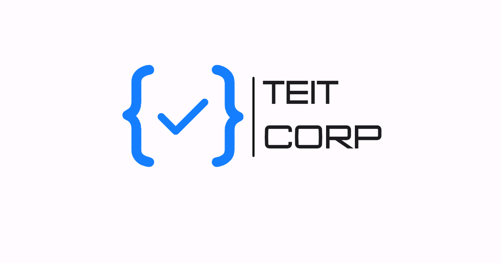

# TEIT CORP Website

Flutter web experience for **TEIT CORP**: a company landing site, a dedicated Flutter expertise page, and supporting brand assets for presenting the studio's work and technical positioning.



## Overview

This repository contains a **Flutter Web** project used to present TEIT CORP as a digital product studio and Flutter-focused development partner.

The app currently includes:

- a branded splash route
- a main company landing page
- a dedicated `/flutter` page focused on Flutter consulting and delivery
- a custom 404 page
- multilingual content in **English, Russian, and Kyrgyz**
- responsive desktop and mobile layouts
- SEO support for web discovery and sharing

For Flutter Consultant certification prep, this project is especially useful because it shows how TEIT CORP presents:

- Flutter-first positioning
- cross-platform delivery knowledge
- responsive UI implementation
- routing and web navigation
- localization handling
- web SEO and metadata work
- real portfolio references linked to published apps

## Live Product Shape

The current site is structured around these routes:

| Route | Purpose |
| --- | --- |
| `/` | Intro splash with branded logo animation and redirect to `/home` |
| `/home` | Main TEIT CORP website |
| `/flutter` | Flutter services / consulting landing page |
| unknown routes | Custom `NotFoundPage` |

## Key Features

- **Responsive UI** for desktop and mobile breakpoints
- **Manual language switching** between `en`, `ru`, and `ky`
- **SEO widgets** via the `seo` package
- **Web metadata** in [`web/index.html`](/Users/timaakatsuki/StudioProjects/teitcorpwebsite/web/index.html)
- **GoRouter navigation** for multi-page web flow
- **Contact actions** through Telegram and email via `url_launcher`
- **Custom visual identity** using project fonts and branded imagery
- **GitHub Pages-ready base path** already configured in `web/index.html`

## Tech Stack

- **Flutter** 3.x
- **Dart**
- [`go_router`](https://pub.dev/packages/go_router)
- [`seo`](https://pub.dev/packages/seo)
- [`url_launcher`](https://pub.dev/packages/url_launcher)
- [`font_awesome_flutter`](https://pub.dev/packages/font_awesome_flutter)
- [`dotted_border`](https://pub.dev/packages/dotted_border)

Local environment check performed on **April 26, 2026**:

- Flutter `3.41.6`
- Dart `3.11.4`

Project SDK constraint from [`pubspec.yaml`](/Users/timaakatsuki/StudioProjects/teitcorpwebsite/pubspec.yaml):

```yaml
environment:
  sdk: '>=3.2.6 <4.0.0'
```

## Project Structure

```text
lib/
  main.dart
  router/
    app_router.dart
  website/
    flutterLandingPage.dart
    logoPage.dart
    notFoundPage.dart
    websitePage.dart

assets/
  images/

fonts/
  Comic.ttf
  Mont.ttf
  Radiotechnika.ttf

web/
  index.html
  manifest.json
  favicon.png
  icons/

test/
  widget_test.dart
```

## Important Screens and Responsibilities

### 1. Main website page

[`lib/website/websitePage.dart`](/Users/timaakatsuki/StudioProjects/teitcorpwebsite/lib/website/websitePage.dart)

Highlights:

- multilingual hero and service sections
- responsive desktop/mobile layouts
- service positioning for TEIT CORP
- project showcase
- footer link into the Flutter-specific page
- Telegram and email contact dialogs

### 2. Flutter consultant landing page

[`lib/website/flutterLandingPage.dart`](/Users/timaakatsuki/StudioProjects/teitcorpwebsite/lib/website/flutterLandingPage.dart)

Highlights:

- explicit Flutter-first messaging
- cross-platform capability positioning for Android, iOS, Web, macOS, and Windows
- state-management expertise messaging
- technical approach and architecture sections
- portfolio app references with Google Play links
- mobile and desktop-specific layouts

### 3. Routing

[`lib/router/app_router.dart`](/Users/timaakatsuki/StudioProjects/teitcorpwebsite/lib/router/app_router.dart)

Uses `GoRouter` to keep the web app organized into clear entry points for brand, home, and Flutter consulting content.

### 4. Web shell and SEO metadata

[`web/index.html`](/Users/timaakatsuki/StudioProjects/teitcorpwebsite/web/index.html)

Important details:

- custom `<base href="/teit_corp/">`
- canonical URL for GitHub Pages
- Open Graph and Twitter metadata
- branded loading screen
- favicon and manifest wiring

## Assets and Branding

The project uses:

- custom brand fonts from [`fonts/`](/Users/timaakatsuki/StudioProjects/teitcorpwebsite/fonts)
- branded images from [`assets/images/`](/Users/timaakatsuki/StudioProjects/teitcorpwebsite/assets/images)
- generated web icons in [`web/icons/`](/Users/timaakatsuki/StudioProjects/teitcorpwebsite/web/icons)

Referenced portfolio visuals include:

- `company1.png`
- `company2.png`
- `teitopengraph.png`
- `phoneHand.png`
- `illustration2.png`
- `illustration3.png`
- `illustration4.png`

## Getting Started

### Prerequisites

- Flutter installed with web support enabled
- Dart SDK compatible with the Flutter version in use

### Install dependencies

```bash
flutter pub get
```

### Run locally

```bash
flutter run -d chrome
```

### Build for web

```bash
flutter build web
```

### Build for GitHub Pages

Because [`web/index.html`](/Users/timaakatsuki/StudioProjects/teitcorpwebsite/web/index.html) currently uses:

```html
<base href="/teit_corp/">
```

keep the deployment path aligned with that base URL when publishing.

## Main Dependencies

From [`pubspec.yaml`](/Users/timaakatsuki/StudioProjects/teitcorpwebsite/pubspec.yaml):

- `go_router`
- `seo`
- `url_launcher`
- `font_awesome_flutter`
- `dotted_border`

## Certification Prep Notes

This section is written to help with the upcoming **Flutter Consultant** form.

### What this project demonstrates

- **Flutter Web delivery** for a real branded site
- **Cross-platform Flutter consulting positioning**
- **Responsive layout engineering**
- **Route-based navigation** with `GoRouter`
- **Localization-ready content structure**
- **SEO-minded Flutter web implementation**
- **External action integration** through email and Telegram
- **Portfolio storytelling** around published Flutter apps

### Useful certification talking points

- TEIT CORP positions Flutter as a strategic platform, not just a framework choice.
- The `/flutter` page shows consulting depth across product architecture, state management, testing, and deployment.
- The codebase contains separate desktop and mobile experiences for important screens.
- The site references production-facing Flutter work, including Google Play app links.
- The project includes web-specific concerns such as canonical URLs, Open Graph metadata, and branded loading behavior.

### Good evidence to mention in the form

- multilingual UI support
- custom routing
- contact and lead-generation flows
- production-ready branding and SEO
- portfolio-backed Flutter service narrative

## Current Gaps to Clean Up Before Submission

These are worth mentioning because they will likely come up when we prepare polished certification answers:

1. The current widget test in [`test/widget_test.dart`](/Users/timaakatsuki/StudioProjects/teitcorpwebsite/test/widget_test.dart) is still the default counter example and does not match the actual app.
2. [`pubspec.yaml`](/Users/timaakatsuki/StudioProjects/teitcorpwebsite/pubspec.yaml) references `assets/icons/`, but that directory is not present in the repository.
3. `flutter analyze` currently reports naming-lint findings for camelCase file names and deprecation notices for `withOpacity`.
4. There is no documented CI/CD workflow in the repository yet.
5. There are no screenshots or release notes captured in the repo for certification evidence.
6. The README was previously generic and has now been replaced with project-specific documentation.

## Recommended Next Steps

Before filling the consultant form, we should prepare:

1. a short project summary
2. your role and responsibilities
3. the architecture choices used in this site
4. proof of Flutter expertise beyond this repo
5. screenshots of `/home` and `/flutter`
6. updated tests and a clean `flutter analyze` / `flutter test` pass
7. a decision on whether to rename Dart files to snake_case or relax the lint rule

## Notes

- Main application entry: [`lib/main.dart`](/Users/timaakatsuki/StudioProjects/teitcorpwebsite/lib/main.dart)
- Router setup: [`lib/router/app_router.dart`](/Users/timaakatsuki/StudioProjects/teitcorpwebsite/lib/router/app_router.dart)
- Analysis rules: [`analysis_options.yaml`](/Users/timaakatsuki/StudioProjects/teitcorpwebsite/analysis_options.yaml)